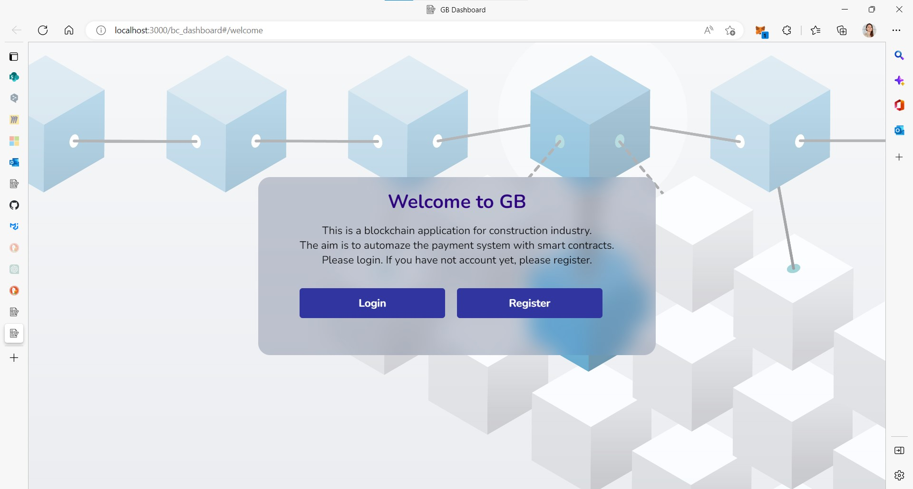

# Goldbeck SmartConstruction ™

 

## About 👀

This is a blockchain application for construction industry developed as part of a Master Thesis for the Master of Integrated Computational Design in collaboration with Goldbeck GmbH. All rights reserved.</p>

### Goal 🎯

<p>The aim is to automaze the payment system with smart contracts.</p>

## How to run 🚀

First, from the root directory:

```cmd
cd frontend
npm install
npm start
```

Then, on the browser go to: http://localhost:3000/bc_dashboard#/welcome

## Disclaimer 💬

## License 💡
